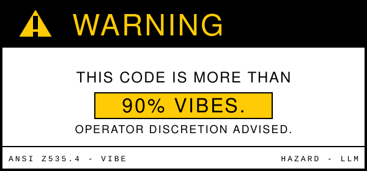
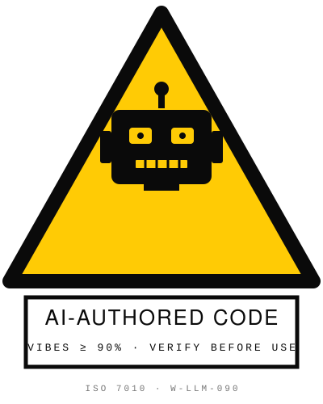

<p align="center">
  
  &nbsp;&nbsp;
  
</p>

How to use: 
- Download this repo, point your agent at `INITIAL_PROMPT_FOR_AGENT.md`
- Also provide:
  - A path to your existing project
  - A path to a fresh basis avatar project
- Good luck!

# BasicCranky

A small Unity Editor toolset for porting VRChat-style skinned clothing/prop meshes onto **BasisVR** avatars, plus one-click jiggle-rig wiring for furry chains (ears/tail/tongue/hair). A name-based armature linker + bind-pose rebaker — basically a cranky little cousin of VRCFury's Armature Link. Cranky because it does the parts that aren't fancy: no axis-flip heuristics, no per-source guards, no UI window. Just menu commands that do what they say.

Self-contained Unity 6 package — depends only on Unity built-ins, with an optional dependency on [JigglePhysics by GatorDragonGames](https://github.com/naelstrof/UnityJigglePhysics) for the jiggle setup tool.

---

## Install

### As a UPM Git package (recommended)

In Unity: `Window ▸ Package Manager ▸ + ▸ Add package from Git URL...` and paste:

```
https://github.com/<your-user>/basic-cranky.git
```

(Replace `<your-user>` with wherever this repo lives.)

The jiggle setup tool additionally needs JigglePhysics — install it the same way:

```
https://github.com/naelstrof/UnityJigglePhysics.git?path=Packages/com.gator-dragon-games.jigglephysics
```

If JigglePhysics isn't installed, the rest of BasicCranky still works; only the jiggle menus will fail to compile (you can either install JigglePhysics or delete `Editor/BasicCrankyJiggleSetup.cs` from your local copy).

### As a manual drop-in

Copy this whole folder into `Assets/BasicCranky/` of any Unity 6 project. The `Editor/` subfolder is picked up automatically by the asmdef.

### From source / for development

```bash
git clone https://github.com/<your-user>/basic-cranky.git
# In Unity Package Manager: + ▸ Add package from disk... ▸ pick the cloned folder's package.json
```

After install, menus appear under `GameObject ▸ Basic Cranky/...` when you right-click a GameObject in the Hierarchy.

---

## The porting workflow

The path for moving a VRChat outfit onto a BasisVR avatar:

1. Import the clothing FBX into Unity. Materials usually need to be rebuilt as URP/Lit from the PBR texture maps.
2. Drag the clothing prefab into your scene as a **child of the avatar root**.
3. Right-click the clothing GameObject → `Basic Cranky ▸ Link Armature to Parent Avatar`.
   - Name-matches every bone in every SkinnedMeshRenderer under the clothing to a bone on the avatar, and adopts any clothing-specific bones (toes, fingers, accessories) under the nearest matched ancestor.
4. If the mesh looks wrong (sunken, offset, collapsed), right-click an SMR → `Basic Cranky ▸ Diagnose SMR Bones`.
5. If bones are right but the mesh sits in the wrong spot, run `Rebake Bind Poses (Current Avatar Pose)` on the SMR.
6. If still wrong, escalate to `Full Rebake (Vertices + Bind Poses)`.
7. For shoes/footwear floating away from the feet, use `Full Rebake + Shift to Feet`.
8. **Shortcut for "I trust this":** `Link + Full Rebake (One Step)` does Link followed by Full Rebake on every SMR it finds.
9. For furry avatars, right-click the avatar root → `Basic Cranky ▸ Add Jiggle Rigs (Ears + Tail + Tongue + Hair)`.

---

## Menu reference

All commands live under `GameObject ▸ Basic Cranky/` (right-click target).

| # | Menu | Select | What it does | Output | When |
|---|---|---|---|---|---|
| 0 | **Link Armature to Parent Avatar** | Clothing root (child of avatar) | Name-matches every SMR's `bones[]` to the avatar's transforms. Adopts unmatched bones under nearest matched ancestor. Moves SMRs directly under avatar root. | Mutates scene | First step of every port |
| 1 | **Rebake Bind Poses (Current Avatar Pose)** | A `SkinnedMeshRenderer` GameObject | Builds new `bindposes[i] = bones[i].worldToLocal * smr.localToWorld`. | New `*_Rebound.asset` | Mesh is offset but topology is right |
| 2 | **Full Rebake (Vertices + Bind Poses)** | A `SkinnedMeshRenderer` GameObject | Per-vertex: replay the skinning with old bindposes + current bones, snapshot world position, write back as local; then rebake bindposes too. | New `*_BoundToAvatar.asset` | Authoring rest pose ≠ avatar rest pose |
| 3 | **Full Rebake + Shift to Feet** | A `SkinnedMeshRenderer` GameObject | Full Rebake, then translate the mesh so its bounds center sits at the avatar's foot midpoint (or rootBone if no feet found). | New `*_OnFeet.asset` | Footwear floating off the avatar |
| 10 | **Diagnose SMR Bones** | Any GameObject with SMRs underneath | Walks every SMR, reports: bone count, null/inside-root/outside-root counts, rootBone status, mesh stats, bindpose translation magnitude range. | Text report (Console + dialog) | Anytime something's off |
| 11 | **Link + Full Rebake (One Step)** | Clothing root (child of avatar) | Runs Link, then Full Rebake on every SMR found. | Multiple `*_BoundToAvatar.asset` meshes | When you know it'll need a Full Rebake anyway |
| 20 | **Add Jiggle Rigs (Ears + Tail + Tongue + Hair)** | Avatar root (or any ancestor with the chains underneath) | For each chain (ear.l, ear.r, tail, tongue, hair), tries a list of name candidates, picks the candidate with the *shortest hierarchy depth* (avoids picking duplicate bones from clothing FBXes), adds a `JiggleRig` component. | `JiggleRig` components | Once per furry avatar import |
| 21 | **Diagnose Jiggle Chain Bones** | Avatar root | Walks the hierarchy and lists every transform whose name matches any candidate, marking which already have JiggleRigs. | Text report | Before/after Add, or when troubleshooting "wrong bone got picked" |
| 22 | **Remove ALL Jiggle Rigs Under Selection** | Any root | Confirms, then deletes every `JiggleRig` component anywhere underneath. | Removes components | Start-over button |

The number is the Unity context-menu priority and also the natural order to try things in when something's wrong.

---

## Output convention

All generated meshes land in **`Assets/_UserContent/Generated/`** (created on first use). Names are derived from the source mesh + a suffix (`_Rebound`, `_BoundToAvatar`, `_OnFeet`). Names are uniquified — re-running doesn't overwrite, so clean the folder occasionally.

The jiggle tools don't write any assets; they only add/remove `JiggleRig` components on existing GameObjects.

---

## Known limitations / troubleshooting

**Mesh collapses to tiny bounds (~mm scale) after rebake.**
The source FBX's bind-pose matrices or vertex coord space don't decode under the standard skinning formula. Seen on `FH_FootWear` from the Freakhound port — 82 bones name-match cleanly, but both bind-pose-only and full vertex+bindpose rebake produce degenerate output. The clothing was authored against a skeleton with different rest pose / axis conventions / scale than the target, and a naive remap can't recover it. Two fixes: (1) re-rig in Blender against the target avatar's rest pose, or (2) extend the tool with per-source normalization (axis flips, weight redistribution) — i.e. the part of VRCFury this tool deliberately doesn't replicate.

**Jiggle rig went onto the wrong bone (inside the clothing wrapper, not the body).**
VRChat clothing FBXes often ship with an internal *copy* of the avatar skeleton, giving duplicate bone names at deeper paths (e.g. `/root/FH_FootWear/Armature/.../ear.l.1`). The Add Jiggle tool resolves this by picking the candidate with the **shortest hierarchy depth** — body bones are one segment shorter than clothing-baked duplicates. If you still get the wrong pick, run `Diagnose Jiggle Chain Bones` to see all candidates, then `Remove ALL Jiggle Rigs Under Selection` and manually add JiggleRig to the right one.

**Jiggle says "none of [...] found".**
Your rig uses a naming convention not in the candidate list. Open `Editor/BasicCrankyJiggleSetup.cs`, find `CHAIN_ROOTS`, and add your bone name to the appropriate row.

**Bones exist in clothing but not in the avatar.**
Link adopts them under their nearest matched ancestor. Verify in the Hierarchy afterwards — sometimes the "nearest match" is too far up the chain and the bone needs to be manually re-parented.

**Avatar has duplicate bone names.**
Link uses first-write-wins on dupes and warns in the Console. If the wrong instance got picked, rename one of them in the avatar before running Link.

**`rootBone` is OUTSIDE the scene root after Link.**
Means the SMR's `rootBone` was the clothing's own armature root and didn't have a name-match on the avatar. Drag the avatar's hip/pelvis bone into the SMR's `rootBone` field manually.

---

## Repo layout

```
basic-cranky/
├── README.md
├── package.json                         UPM manifest (com.an.basiccranky)
├── .gitignore
└── Editor/
    ├── BasicCranky.Editor.asmdef        editor-only assembly (refs JigglePhysics by GUID)
    ├── BasicCrankyShared.cs             constants only
    ├── BasicCrankyArmatureLink.cs       Link + Link+Bake (one step)
    ├── BasicCrankyRebake.cs             Bind poses only
    ├── BasicCrankyFullRebake.cs         Vertices + bind poses
    ├── BasicCrankyShiftToFeet.cs        Full rebake + foot anchor
    ├── BasicCrankyDiagnose.cs           SMR/bone report
    └── BasicCrankyJiggleSetup.cs        Add / Diagnose / Remove JiggleRigs
```

Each operation lives in its own static class, namespace `BasicCranky`, under ~250 lines. The only cross-file dependency is `BasicCrankyArmatureLink.LinkAndBakeSelected()` calling `BasicCrankyFullRebake.FullBakeSelected()` — that method is intentionally `public` for this reason.

---

## License

Unlicensed for now. Treat as "personal tool, use at your own risk." Drop in a license of your choice when publishing.
